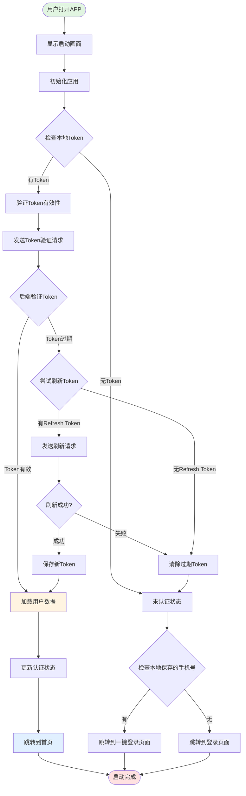
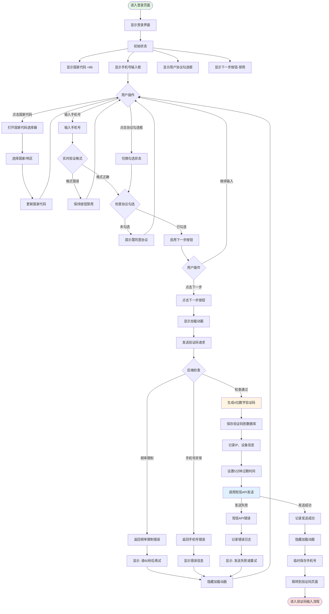
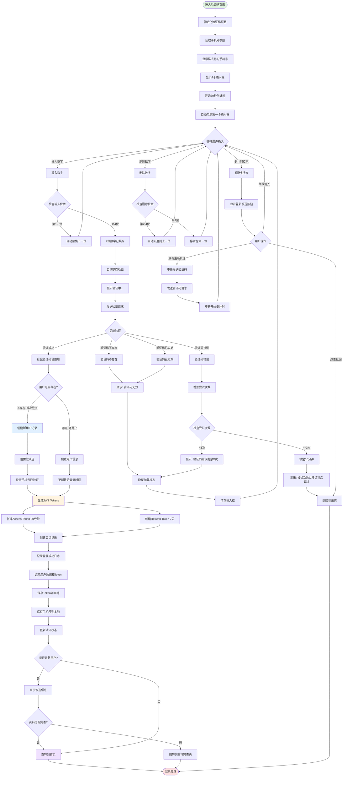
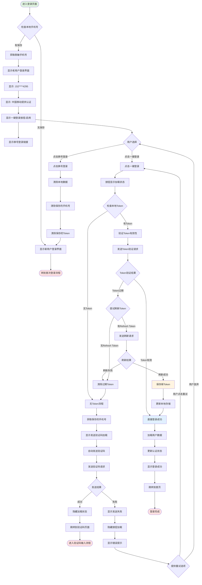
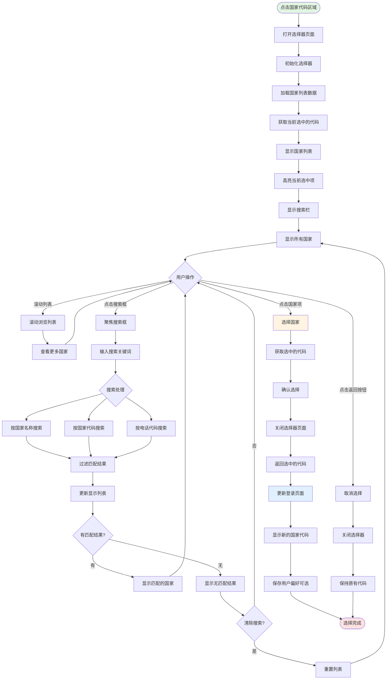
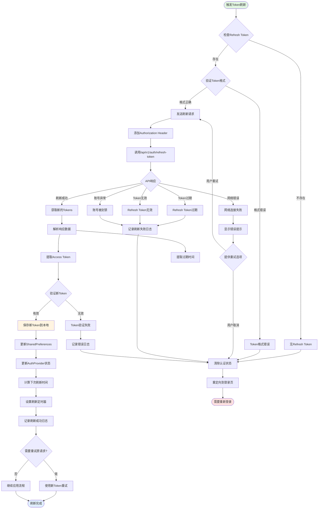
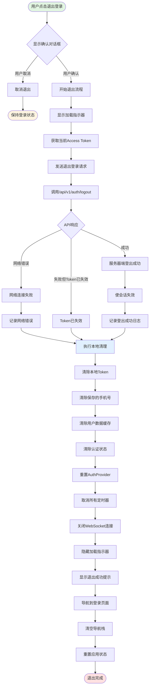
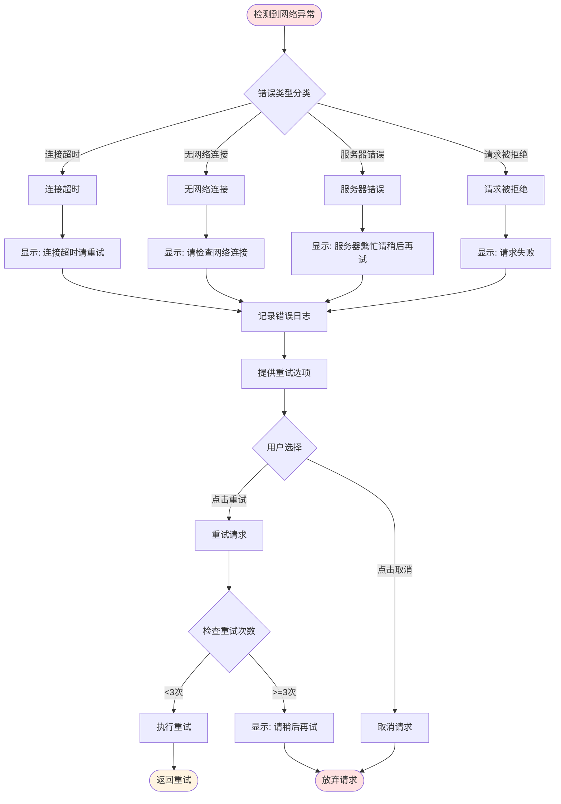
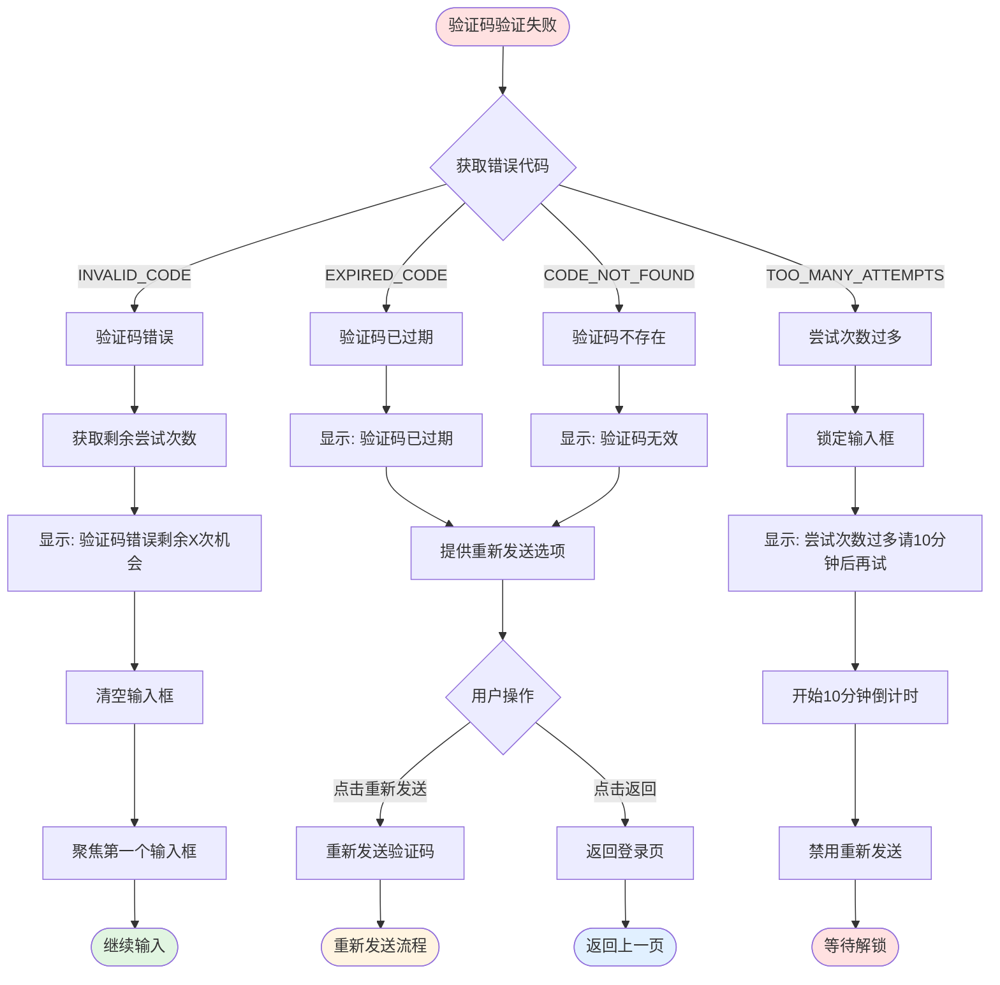

# 用户登录系统流程图

本文档描述了基于手机号验证码的登录系统流程，包括首次登录、老用户一键登录、国家代码选择等核心流程。

---

## 一、应用启动与认证检查流程

---

## 二、首次登录（新用户）流程

---

## 三、验证码输入与验证流程

---

## 四、老用户一键登录流程

---

## 五、国家/地区代码选择流程

---

## 六、Token刷新流程

---

## 七、退出登录流程

---

## 八、异常处理流程

### 8.1 网络异常处理

### 8.2 验证码错误处理

---

## 九、完整用户旅程总览

```mermaid
flowchart TD
    Start([用户下载安装APP]) --> FirstOpen[首次打开APP]
    FirstOpen --> SplashScreen[显示启动画面]
    SplashScreen --> NoAuthDetected[检测到未登录]
    
    NoAuthDetected --> ShowLoginPage[显示登录页面]
    ShowLoginPage --> InputPhoneNumber[输入手机号]
    InputPhoneNumber --> AgreeTerms[同意用户协议]
    AgreeTerms --> SendSMS[发送验证码]
    
    SendSMS --> ReceiveSMS[收到短信验证码]
    ReceiveSMS --> InputCode[输入验证码]
    InputCode --> VerifySuccess[验证成功]
    
    VerifySuccess --> CheckNewUser{是否新用户?}
    CheckNewUser -->|是| CreateAccount[创建账号]
    CheckNewUser -->|否| LoadExistingAccount[加载现有账号]
    
    CreateAccount --> GuideProfileSetup[引导完善资料]
    GuideProfileSetup --> FillNickname[填写昵称]
    FillNickname --> SelectSkillLevel[选择网球水平]
    SelectSkillLevel --> UploadAvatar[上传头像可选]
    UploadAvatar --> ProfileComplete[资料完善完成]
    
    LoadExistingAccount --> WelcomeBack[欢迎回来]
    ProfileComplete --> FirstLogin[首次登录完成]
    WelcomeBack --> FirstLogin
    
    FirstLogin --> SavePhoneLocally[保存手机号到本地]
    SavePhoneLocally --> EnterApp[进入应用]
    
    EnterApp --> UseApp[使用应用功能]
    UseApp --> CloseApp[关闭应用]
    
    CloseApp --> NextOpen[再次打开APP]
    NextOpen --> ShowSplashAgain[显示启动画面]
    ShowSplashAgain --> CheckAuth[检查认证状态]
    
    CheckAuth --> TokenValid{Token有效?}
    TokenValid -->|是| DirectEnter[直接进入应用]
    TokenValid -->|否| ShowOneClickLogin[显示一键登录]
    
    ShowOneClickLogin --> DisplayMaskedPhone[显示脱敏手机号]
    DisplayMaskedPhone --> ClickOneClick[点击一键登录]
    ClickOneClick --> QuickVerify[快速验证]
    
    QuickVerify --> LoginSuccess[登录成功]
    LoginSuccess --> EnterAppAgain[进入应用]
    
    DirectEnter --> ContinueUse[继续使用]
    EnterAppAgain --> ContinueUse
    
    ContinueUse --> End([持续使用])
    
    style Start fill:#e1f5e1
    style End fill:#e1f0ff
    style CreateAccount fill:#fff4e1
    style QuickVerify fill:#e1f0ff
```

---

## 总结

本文档详细描述了基于手机号验证码的现代化登录系统的完整流程，包括：

1. **应用启动与认证检查**：Token验证和自动登录
2. **首次登录流程**：手机号输入、验证码发送、验证和注册
3. **验证码验证流程**：4位数字输入、自动提交、错误处理
4. **一键登录流程**：快速登录、Token刷新、自动验证
5. **国家代码选择**：列表展示、搜索、选择
6. **Token刷新机制**：自动刷新、过期处理
7. **退出登录流程**：本地清理、服务器端登出
8. **异常处理**：网络异常、验证码错误

每个流程图都清晰地展示了各个步骤、判断条件和可能的异常情况，为开发和测试提供了完整的参考。
